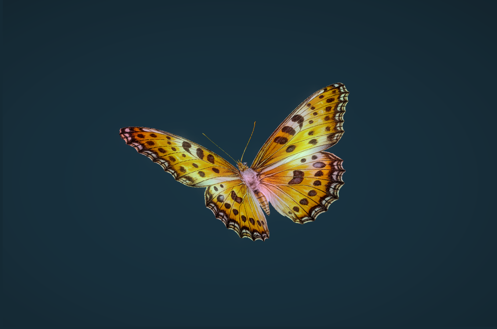

# WebGL Butterfly Demo

[](https://webgl-butterfly.dr.deno.net)

A 3D butterfly animation built with React Three Fiber, featuring shader-based wing flapping and post-processing effects.



## Features

- **Shader-based Animation**: Custom GLSL vertex and fragment shaders for realistic wing movement
- **Auto-decay System**: Wings gradually slow down with automatic periodic re-animation
- **Post-processing**: Bloom effects and camera shake for visual polish
- **Gradient Background**: Custom shader-based radial gradient backdrop

## Tech Stack

- **React 19** with TypeScript (strict mode)
- **React Three Fiber** - React renderer for Three.js
- **@react-three/drei** - Useful helpers and abstractions
- **@react-three/postprocessing** - Post-processing effects
- **Three.js** - 3D graphics library
- **GLSL Shaders** - Custom vertex and fragment shaders
- **Vite 6.2** - Build tool and dev server

## Getting Started

### Prerequisites

- Node.js (LTS version recommended)
- just - https://just.systems/
- npm

### Installation

```bash
npm install
```

### Development

```bash
just dev
```

### Build

```bash
just build
```

### Preview Production Build

```bash
just preview
```

### Linting

```bash
just lint
```

## Deployment

This project is configured to deploy to Deno Deploy:

```bash
# Deploy to staging
just deploy

# Deploy to production
just deploy-prod
```
